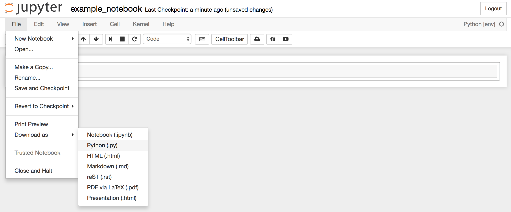
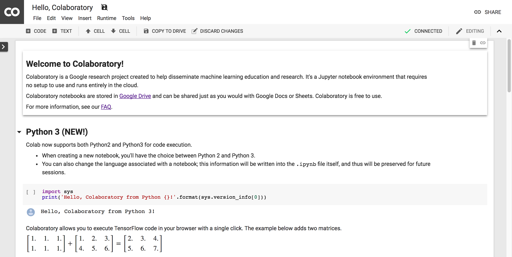

# Part 1: Environment Setup

## tl;dr
```
# Make sure you have virtualenv
pip install virtualenv

# Create an environment for TensorFlow development
virtualenv env --python=python3

# Activate the environment
source env/bin/activate

# Install TensorFlow
pip3 install tensorflow-gpu # with GPU -- additional setup steps need to be taken for GPU support (coming soon).
pip3 install tensorflow # without GPU

# Install Jupyter
pip3 install jupyter

# Create a project
mkdir my_new_project
cd my_new_project

# Start jupyter
jupyter notebook

# Create a new notebook
# New (button) --> Python [env]

```

## Machine

<span class='tldr'><b>tl;dr: </b>Get yourself an Ubuntu laptop or desktop with an NVIDIA GeForce GTX 1060, 1070, or 1080 GPU right now.</span>

Using the right machine can be the difference between an exciting, but unrecognized idea, and the next hit project.

#### Software
There is official support for Mac, Linux, and Windows machines.  However, almost everyone uses either Mac or Linux.  Linux (Ubuntu) is the best choice since you can find a lot of Linux machines for sale with NVIDIA GPUs (the only GPUs that work with TensorFlow).  Mac laptops don't have NVIDIA GPUs but you can technically set up external GPUs.  Also, if you have the money to get a Mac Pro, NVIDIA launched the [NVIDIA TITAN Xp](https://blogs.nvidia.com/blog/2017/04/06/titan-xp/) in May of 2017 that is Mac Pro compatible.

#### Hardware
In general, the following hardware setups are roughly ordered both in their benefit and the difficulty of set up:

1. <b>Worst:</b> Local CPU Only Machine
2. Your Organization's CPU Only Machines
3. <b>Recommended:</b> Local CPU+GPU Machine
4. Your Organization's GPU Only Machines
5. <b>Best:</b> Distributed GPUs on a cloud service (Google Cloud, AWS, Azure)

Note that TensorFlow only supports NVIDIA GPUs

<span class='protip'><b>Pro tip:</b> if buying a decent desktop with a good GPU (NVIDIA GeForce GTX 1060-1080) is close to within your budget, do it now.  You are going to do it eventually and you don't want to give up on machine learning because you got frustrated with your lack of computing power.</span>

Having some, any, kind of GPU will help every deep learning project you do immensely.  For example, doing < task > on a CPU would take < time > but on a GPU it would only take < time >.  That's the difference between trying out a new project one night and seeing it work and running the same project, checking back in two days, forgetting what parameters you used, getting frustrated, and giving up.

Or, for another way of looking at this, enjoy Adam and Jamie from Mythbusters explain the power of GPUs. (Interesting to note this was made in 2009 and sponsored by NVIDIA.)

<div style="text-align: center;">
	<iframe width="560" height="315" src="https://www.youtube.com/embed/-P28LKWTzrI?rel=0" frameborder="0" gesture="media" allow="encrypted-media" allowfullscreen align="center"></iframe>
</div>

Hardware is a big topic I've only just gotten interested in recently.  This post is mostly about TensorFlow best practices.  In a future post I will share many more details on what hardware is best and why.

Now that you have your hardware ready, let's get up and running with the software.

## Virtual Environments
Despite many people trying to get me to switch to [Conda environments](https://conda.io/docs/user-guide/tasks/manage-environments.html), I still find virtualenv the easiest tool to use for managing python dependencies.

[Virtualenv](https://virtualenv.pypa.io/en/stable/) creates isolated Python environments so we can install different dependencies for different projects.

First, make sure you have virtualenv on your machine.

```
pip install virtualenv
```

Next, create an environment for TensorFlow development.  This command will create a directory called <em>env</em> where all our dependencies will be stored.

```
virtualenv env --python=python3
```

To start using this environment, 'activate' it with the following command:
```
source env/bin/activate
```

Notice you should now see (env) appended to your terminal message.  For example mine changed from<br>
```
tcrosley: ...
```

to 

```
(env) tcrosley: ...
```

That means you are good to go.  Now, when you pip install something, it will install the new package to this virtual environment.  This may be important if you have different project using different versions of TensorFlow.  One of your old projects may use an environment with TensorFlow Version 1.X for backwards compatibility and TensorFlow Version 1.Y for all the latest features.

## Installing TensorFlow


##### CPU Version
This guide only requires the CPU installation of TensorFlow.  Fortunately, installing this is as easy as:
```
pip3 install tensorflow
```

You should now be able to import TensorFlow.
```
python3
>>> import tensorflow as tf
>>> tf.__version__
# '1.4.0' as of this writing
```

##### GPU Version
Installing TensorFlow with GPU support is more difficult and requires installing cuda and cuDNN.  More to come on this later...
```
Coming Soon
```

## Jupyter Notebooks
If you aren't using [Jupyter Notebooks](http://jupyter.org/) yet, start now.  I put off making the switch for far too long and research has gotten immeasurably more enjoyable since I did.  "The Jupyter Notebook is an open-source web application that allows you to create and share documents that contain live code, equations, visualizations and narrative text." - jupyter.org<br>

Jupyter is a program you run locally that pops open a tab in your web browser that looks like this...


It is the perfect environment for prototyping in machine learning and data science.  You can test out snippets of code, visualize images (such as your dataset to make sure you are loading it correctly), run training, etc.

<span class="protip"><b>Pro tip:</b> If you will eventually run the training on a server, prototype using Jupyter and then export the .ipynb notebook file as a .py with File --> Download as --> Python (.py) from inside the notebook.
</span>
<br><br>


<span class='sidenote'><b>Side note:</b> Google now has something called [Collaboratory](https://colab.research.google.com/) which takes Jupyter Notebooks and integrates them with Google Drive.  Collaboratory picks up a lot of the features from Google Docs such as saving in Drive, sharing a file with otheres who can live edit/run, and leave comments/feedback like you would any other Google Docs file.  I'm just starting to use these but think they are really exciting for projects with a lot of informal collaboration.</span>
<br><br>


<hr>
## Continue Reading

<button onclick="location.href='dataprep'" class='continue-links'>Continue to Part 2</button>
In Part 2 we will see how to prepare a dataset in TensorFlow's TFRecord format.

<hr>

<div style="text-align: center;">
	<button onclick="location.href='setup'" class='continue-links'>Part 1: Setup</button>
	<button onclick="location.href='dataprep'" class='continue-links'>Part 2: Preparing Data</button>
	<button onclick="location.href='dataload'" class='continue-links'>Part 3: Consuming Data</button>
	<button onclick="location.href='model'" class='continue-links'>Part 4: Defining a Model</button>
	<button onclick="location.href='traineval'" class='continue-links'>Part 5: Training and Evaluating</button>
	<button onclick="location.href='deploy'" class='continue-links'>Part 6: Exporting, Testing, and Deploying</button>
	<button onclick="location.href='summary'" class='continue-links'>Part 7: All Together Now</button>
	<button onclick="location.href='references'" class='continue-links'>Part 8: Furthur Reading and References</button>
</div>