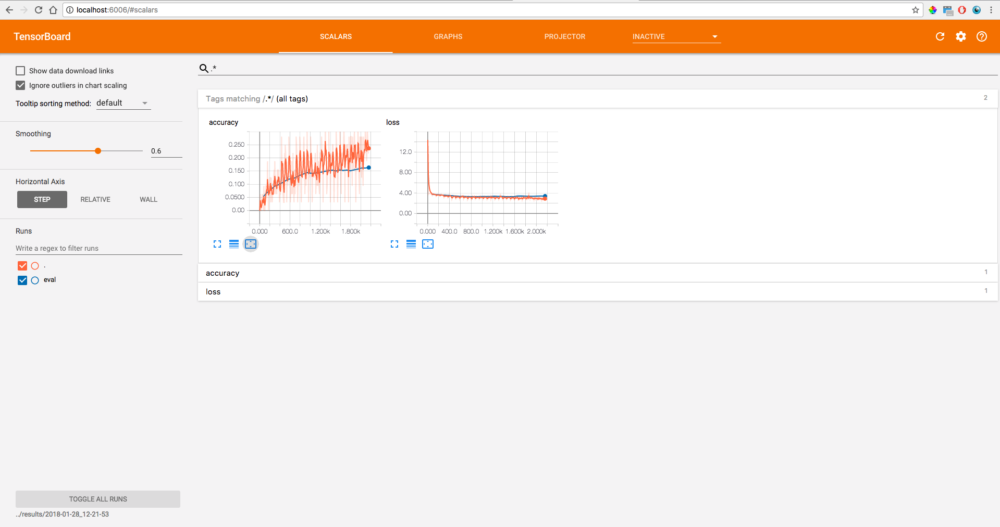

# Part 5: Training and Evaluating

<div style="text-align: center">
	<a href="https://www.tensorflow.org/get_started/summaries_and_tensorboard" target="_blank">TensorFlow Getting Start - TensorBoard</a><br>
	<a href="https://www.digitalocean.com/community/tutorials/how-to-use-sshfs-to-mount-remote-file-systems-over-ssh" target="_blank">Digital Ocean SSHFS Guide</a><br>
	<a href="https://osxfuse.github.io/" target="_blank">SSHFS/FUSE for Mac</a><br>
</div>

The hard part is done.  Now, all we have to do is kick off training and use <a href="https://www.tensorflow.org/get_started/summaries_and_tensorboard" target="_blank">TensorBoard</a> to monitor the progress.

## Starting Training and Evaluation

To start training and evaluating, simply use the following code.

```
################################
###   Inside code/train.py   ###
################################

# Training/Evaluation Loop
for e in range(params.train_epochs):
    print('Epoch: ' + str(e))
    estimator.train(input_fn=lambda: dataset_input_fn('train'))
    estimator.evaluate(input_fn=lambda: dataset_input_fn('valid'))
```

Both ```train``` and ```evaluate``` run until ```input_fn``` raises an ```OutOfRangeError``` which happens at the end of the dataset since we are using the <a href="https://www.tensorflow.org/api_docs/python/tf/data/Dataset" target="_blank">Dataset</a> and <a href="https://www.tensorflow.org/api_docs/python/tf/data/Iterator" target="_blank">Iterator</a> APIs.

## Using TensorBoard to Monitor Progress

The best way to check in on the training of your model is with <a href="https://www.tensorflow.org/get_started/summaries_and_tensorboard" target="_blank">TensorBoard</a> -- another tool built by Google for visualization of TensorFlow projects.



It used to be a bit of a pain to get TensorBoard working but with Estimator's it's quite easy.  All the metrics we defined in the Part 4 ```model_fn``` are automatically written to TensorBoard.  Now all we have to do is run the TensorBoard program.

<span class="protip"><b>Tip: </b>Right before the training loop I have the following line to make starting TensorBoard one step easier.  Copy/paste what it prints out into a terminal to launch TensorBoard.</span>
```
################################
###   Inside code/train.py   ###
################################
print('tensorboard --logdir=' + str(model_dir))
```

To see TensorBoard, open a web browser and go to ```localhost:6000```

<span class="protip"><b>Tip: </b>If you have multiple models at the same time you can run two instances of TensorBoard, you just need to pass separate port numbers with \-\-port=XXXX</span>

That's it!  Your model is now training, evaluating once at the end of every epoch, and reporting results intermittently to your live updating TensorBoard.

## Training Remotely, Monitoring Locally
Often times you will be running your training on a remote server, say you department's or company's cluster.  If you start a training job on a remote instance and still want to use TensorBoard to track training progress live, I recommend mounting the remote output directory locally with <a href="https://en.wikipedia.org/wiki/SSHFS" target="_blank">SSHFS</a>.  SSHFS gives you a local copy of a remote directory and continually updates the files in that directory as they change.  SSHFS should be installed already if you are using Linux.  If you using a Mac, you probably need to install SSHFS/Fuse <a href="https://osxfuse.github.io/" target="_blank">here</a>.

I have a directory that's only for mounting with SSHFS.
```
mkdir ~/mnt
```

Let's say you are training a model on a remote host ```remote.school.edu```, your username is ```user```, and the ```output_dir``` is ```~/Documents/project/results/2017-12-04_14-19-29/```.  You can mount the output directory to your local mount director with:

```
sshfs user@remote.school.edu:~/Documents/project/results/2017-12-04_14-19-29/ ~/mnt/ -oauto_cache,reconnect,defer_permissions,noappledouble,negative_vncache,volname=MySSHFSMount
```

I needed the extra flags for connecting between my mac and the particular server I was working with but your setup may be slightly different.

<span class="example"><b>Running Example: </b>the complete (up to this point) train.py file can be found <a href="code/train_part5.py">here</a>.</span>

<hr>
## Continue Reading

<button onclick="location.href='export'" class='continue-links'>Continue to Part 6</button>
In Part 6 we will export and load the model back in with a few different methods.

<hr>
<div style="text-align: center;">
	<button onclick="location.href='https://crosleythomas.github.io/blog/'" class='continue-links' target="_blank">Blog</button>
    <button onclick="location.href='introduction'" class='continue-links'>Introduction</button>
    <button onclick="location.href='setup'" class='continue-links'>Part 1: Setup</button>
    <button onclick="location.href='dataprep'" class='continue-links'>Part 2: Preparing Data</button>
    <button onclick="location.href='dataload'" class='continue-links'>Part 3: Consuming Data</button>
    <button onclick="location.href='model'" class='continue-links'>Part 4: Defining a Model</button>
    <button onclick="location.href='traineval'" class='continue-links'>Part 5: Training and Evaluating</button>
    <button onclick="location.href='export'" class='continue-links'>Part 6: Exporting, Testing, and Deploying</button>
    <button onclick="location.href='summary'" class='continue-links'>Part 7: All Together Now</button>
    <button onclick="location.href='references'" class='continue-links'>Part 8: Furthur Reading and References</button>
</div>
